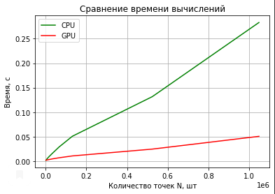
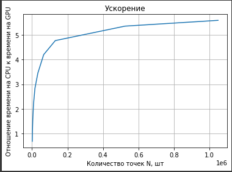

# Lab №2 - Pi Calculating (Monte Carlo)
## Petrov Leonid 6133-010402D

## Задание

__Задача__: Реализовать две функции рассчёта числа Пи на CPU и на GPU

## Техническое оборудование

<b>__IDE__</b>: Google Colaboratory

<b>__GPU__</b>: Tesla K80

<b>__CPU__</b>: Intel(R) Xeon(R) CPU @ 2.30GHz

## Описание

Для выполнения данной лабораторной работы использовался язык программирования <b>Python</b> и библиотека <b>numba</b>. Для осуществления генерации числа от 0 до 1 по методу Монте-Карло использовалось средство [xoroshiro128p](https://numba.pydata.org/numba-doc/0.41.0/cuda/random.html).

Функция вычисления <b><i>Pi</i></b> на GPU представлена функцией *gpuMonteCarloMethod*, в которой каждая нить генерирует координаты точки (x, y) и при соблюдении условия 
**(x^2 +y^2 < 1)** увеличивает параметр суммы на коэффициент **4/N**. Так же, стоит заметить, что количество нитей соответствует числу точек.

Функция вычисления <b><i>Pi</i></b> на CPU представлена функцией *cpuMonteCarloMethod*. Алгоритм практически в точности повторяет то, что было реализованно для GPU.

В представленной ниже таблице представлены средние значений времени вычислений, подсчет усредненного отклонения подсчитанного числа <b><i>Pi</i></b> от истинного и усредненный результат вычисления числа <b><i>Pi</i></b> (11 повторений).

## Графики

## Таблица
<table border="0" cellpadding="0" cellspacing="0" id="sheet0" class="sheet0 gridlines">
        <col class="col0">
        <col class="col1">
        <col class="col2">
        <col class="col3">
        <col class="col4">
        <col class="col5">
        <col class="col6">
        <col class="col7">
        <tbody>
          <tr class="row0">
            <td class="column0">&nbsp;</td>
            <td class="column1 style1 s">Размерности</td>
            <td class="column2 style1 s">CPU:Среднее время</td>
            <td class="column3 style1 s">GPU:Среднее время</td>
            <td class="column4 style1 s">CPU:Среднее отклонение</td>
            <td class="column5 style1 s">GPU:Среднее отклонение</td>
            <td class="column6 style1 s">CPU Усредненный результат</td>
            <td class="column7 style1 s">GPU Усредненный результат</td>
          </tr>
          <tr class="row1">
            <td class="column0 style1 n">0</td>
            <td class="column1 style0 n">1024</td>
            <td class="column2 style0 n">0.0014835119247437</td>
            <td class="column3 style0 n">0.0019919872283936</td>
            <td class="column4 style0 n">0.013858278589793</td>
            <td class="column5 style0 n">0.028311403589793</td>
            <td class="column6 style0 n">3.127734375</td>
            <td class="column7 style0 n">3.11328125</td>
          </tr>
          <tr class="row2">
            <td class="column0 style1 n">1</td>
            <td class="column1 style0 n">2048</td>
            <td class="column2 style0 n">0.0021521704537528</td>
            <td class="column3 style0 n">0.0019201664697556</td>
            <td class="column4 style0 n">0.0038508381136024</td>
            <td class="column5 style0 n">0.048772724466868</td>
            <td class="column6 style0 n">3.1377418154762</td>
            <td class="column7 style0 n">3.0928199291229</td>
          </tr>
          <tr class="row3">
            <td class="column0 style1 n">2</td>
            <td class="column1 style0 n">4096</td>
            <td class="column2 style0 n">0.0034138262271881</td>
            <td class="column3 style0 n">0.0021262466907501</td>
            <td class="column4 style0 n">0.00087610085541812</td>
            <td class="column5 style0 n">0.046103151636668</td>
            <td class="column6 style0 n">3.1407165527344</td>
            <td class="column7 style0 n">3.0954895019531</td>
          </tr>
          <tr class="row4">
            <td class="column0 style1 n">3</td>
            <td class="column1 style0 n">8192</td>
            <td class="column2 style0 n">0.0054800510406494</td>
            <td class="column3 style0 n">0.0024670445641806</td>
            <td class="column4 style0 n">0.0021599682700257</td>
            <td class="column5 style0 n">0.042301328974315</td>
            <td class="column6 style0 n">3.1394326853198</td>
            <td class="column7 style0 n">3.0992913246155</td>
          </tr>
          <tr class="row5">
            <td class="column0 style1 n">4</td>
            <td class="column1 style0 n">16384</td>
            <td class="column2 style0 n">0.0089781946606106</td>
            <td class="column3 style0 n">0.0031246211793688</td>
            <td class="column4 style0 n">0.00095409022173776</td>
            <td class="column5 style0 n">0.038954170542308</td>
            <td class="column6 style0 n">3.1406385633681</td>
            <td class="column7 style0 n">3.1026384830475</td>
          </tr>
          <tr class="row6">
            <td class="column0 style1 n">5</td>
            <td class="column1 style0 n">32768</td>
            <td class="column2 style0 n">0.015048357156607</td>
            <td class="column3 style0 n">0.0042238785670354</td>
            <td class="column4 style0 n">0.00017889157056228</td>
            <td class="column5 style0 n">0.035025270777293</td>
            <td class="column6 style0 n">3.1414137620192</td>
            <td class="column7 style0 n">3.1065673828125</td>
          </tr>
          <tr class="row7">
            <td class="column0 style1 n">6</td>
            <td class="column1 style0 n">65536</td>
            <td class="column2 style0 n">0.026340343450245</td>
            <td class="column3 style0 n">0.0062703741224189</td>
            <td class="column4 style0 n">0.00052595180114201</td>
            <td class="column5 style0 n">0.031588943796702</td>
            <td class="column6 style0 n">3.1410667017887</td>
            <td class="column7 style0 n">3.1100037097931</td>
          </tr>
          <tr class="row8">
            <td class="column0 style1 n">7</td>
            <td class="column1 style0 n">131072</td>
            <td class="column2 style0 n">0.046345809410358</td>
            <td class="column3 style0 n">0.010025361488605</td>
            <td class="column4 style0 n">0.0006449389705403</td>
            <td class="column5 style0 n">0.027925642328807</td>
            <td class="column6 style0 n">3.1409477146193</td>
            <td class="column7 style0 n">3.113667011261</td>
          </tr>
          <tr class="row9">
            <td class="column0 style1 n">8</td>
            <td class="column1 style0 n">524288</td>
            <td class="column2 style0 n">0.12382197380066</td>
            <td class="column3 style0 n">0.024021620653114</td>
            <td class="column4 style0 n">0.00065702824102098</td>
            <td class="column5 style0 n">0.02489963372285</td>
            <td class="column6 style0 n">3.1409356253488</td>
            <td class="column7 style0 n">3.1166930198669</td>
          </tr>
          <tr class="row10">
            <td class="column0 style1 n">9</td>
            <td class="column1 style0 n">1048576</td>
            <td class="column2 style0 n">0.25972306400264</td>
            <td class="column3 style0 n">0.048269630572118</td>
            <td class="column4 style0 n">0.00064858391116296</td>
            <td class="column5 style0 n">0.02252450783784</td>
            <td class="column6 style0 n">3.1409440696786</td>
            <td class="column7 style0 n">3.119068145752</td>
          </tr>
        </tbody>
    </table>

## Вывод
В данной лабораторной работе производился эксперимент по вычислению числа <b><i>Pi</i></b> по методу Монте-Карло. Данный метод был реализован на языке <b>Python</b> (CPU),
так и с помощью библиотеки <b>numba</b> (GPU). По результату эксперимента видно, что вычисления на CPU значительно уступают распределенной версии на GPU, реализованной с помощью numba.
Так же стоит заметить, что на результат так же мог повлиять тот факт, что генерация случайных значений производилась не на CPU, а непосредственно на GPU, так что затраты на передачу данных 
сведены к минимуму.
