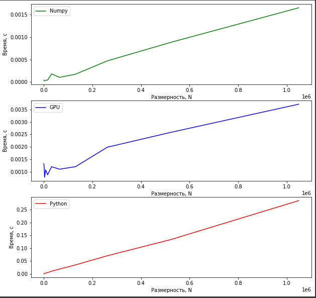
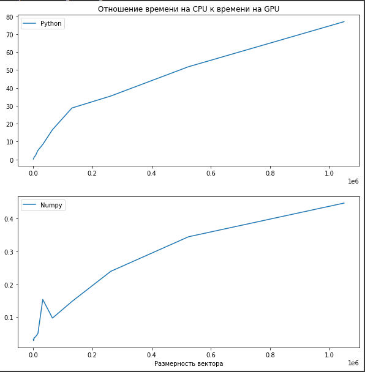

# Lab №1 - Vector Reduction
## Petrov Leonid 6133-010402D

## Задание

<b>Задача</b>: реализовать алгоритм сложения элементов вектора

<b>Язык</b>: C++ или Python

<b>Входные данные</b>: Вектор размером 1 000...1 000 000 значений.

<b>Выходные данные</b>: сумма элементов вектора + время вычисления

<b>Реализация должна содержать 2 функции перемножения матриц</b>: 2 функции сложения элементов вектора: на CPU и на
GPU с применением CUDA.

<b>Отчет о проделанной лабораторной работе</b> - это git-репозиторий с исходным кодом реализации + описание проделанной работы там же в readme.
Необходимо описать реализацию, объяснив, что конкретно было распараллелено и почему.

<b>Провести эксперименты</b>:  получить сумму векторов разных размеров (провести 5 или более экспериментов), посчитать ускорение. Результаты привести в виде таблицы/графика.

## Техническое оборудование

<b>Среда разработки</b>: Google Colaboratory

<b>GPU</b>: Tesla K80

<b>CPU</b>: Intel(R) Xeon(R) CPU @ 2.30GHz

## Описание
Код для суммирования вектора (редукции) на <b>GPU</b> представлен в виде строки, в которой заключен C++ код. Данные код зановится в компилятор библиотеки <b>pycuda</b>, после чего выполняется.
Сам же принцип редуцирования вектора представлен по ссылке: https://developer.download.nvidia.com/assets/cuda/files/reduction.pdf

Для получения более полной картины, вычисления на <b>CPU</b> производились двумя способами. Первый из них - это реализации редукции стандартными методами языка <b>Python</b>
(в частности использовалась функция <b><i>sum</i></b>). Второй способ реализации представлял собой использование функции <b><i>sum</i></b> библиотеки <b><i>numpy</i></b>

Количество итераций - 10.  
Билбиотека для замера времени - <b>time</b>.

Для удобоваримой проверки результатов сумирования вектор, изначально, заполняется нулями.
Память выделяется, как для исходного вектора, так и для результирующего.

## Графики

## Таблица
<table border="0" cellpadding="0" cellspacing="0" id="sheet0" class="sheet0 gridlines">
        <col class="col0">
        <col class="col1">
        <col class="col2">
        <col class="col3">
        <tbody>
          <tr class="row0">
            <td class="column0">&nbsp;</td>
            <td class="column1 style1 s">Numpy</td>
            <td class="column2 style1 s">StandartPython</td>
            <td class="column3 style1 s">GPU</td>
          </tr>
          <tr class="row1">
            <td class="column0 style1 n">1024</td>
            <td class="column1 style0 n">4.3842527601454E-5</td>
            <td class="column2 style0 n">0.00030281808641222</td>
            <td class="column3 style0 n">0.0013220575120714</td>
          </tr>
          <tr class="row2">
            <td class="column0 style1 n">2048</td>
            <td class="column1 style0 n">3.5021040174696E-5</td>
            <td class="column2 style0 n">0.00075448883904351</td>
            <td class="column3 style0 n">0.0012020534939236</td>
          </tr>
          <tr class="row3">
            <td class="column0 style1 n">4096</td>
            <td class="column1 style0 n">2.9272503323025E-5</td>
            <td class="column2 style0 n">0.0011023680369059</td>
            <td class="column3 style0 n">0.00077531072828505</td>
          </tr>
          <tr class="row4">
            <td class="column0 style1 n">8192</td>
            <td class="column1 style0 n">4.3021308051215E-5</td>
            <td class="column2 style0 n">0.002344184451633</td>
            <td class="column3 style0 n">0.0010720358954536</td>
          </tr>
          <tr class="row5">
            <td class="column0 style1 n">16384</td>
            <td class="column1 style0 n">4.4001473320855E-5</td>
            <td class="column2 style0 n">0.0044510629442003</td>
            <td class="column3 style0 n">0.00087391005622016</td>
          </tr>
          <tr class="row6">
            <td class="column0 style1 n">32768</td>
            <td class="column1 style0 n">0.00018445650736491</td>
            <td class="column2 style0 n">0.010087543063694</td>
            <td class="column3 style0 n">0.0011988745795356</td>
          </tr>
          <tr class="row7">
            <td class="column0 style1 n">65536</td>
            <td class="column1 style0 n">0.00010683801439073</td>
            <td class="column2 style0 n">0.018298811382718</td>
            <td class="column3 style0 n">0.0010981559753418</td>
          </tr>
          <tr class="row8">
            <td class="column0 style1 n">131072</td>
            <td class="column1 style0 n">0.00017711851331923</td>
            <td class="column2 style0 n">0.034507195154826</td>
            <td class="column3 style0 n">0.0011994308895535</td>
          </tr>
          <tr class="row9">
            <td class="column0 style1 n">262144</td>
            <td class="column1 style0 n">0.00047455893622504</td>
            <td class="column2 style0 n">0.070317957136366</td>
            <td class="column3 style0 n">0.0019829273223877</td>
          </tr>
          <tr class="row10">
            <td class="column0 style1 n">524288</td>
            <td class="column1 style0 n">0.00088908937242296</td>
            <td class="column2 style0 n">0.13382474581401</td>
            <td class="column3 style0 n">0.0025820732116699</td>
          </tr>
          <tr class="row11">
            <td class="column0 style1 n">1048576</td>
            <td class="column1 style0 n">0.0016569031609429</td>
            <td class="column2 style0 n">0.28561613294813</td>
            <td class="column3 style0 n">0.0037104818556044</td>
          </tr>
        </tbody>
    </table>

## Вывод
По результатам проведенных экспериментов видно, что наилучший результат показывает функция <b>sum</b> из библиотеки <b>numpy</b> языка Python. Худший результат показывает функция <b>sum</b>
которая является стандартной функцией языка программирования Python. Между ними располагается результат редукции вектора с помощью <B>GPU</b> (CUDA). 
